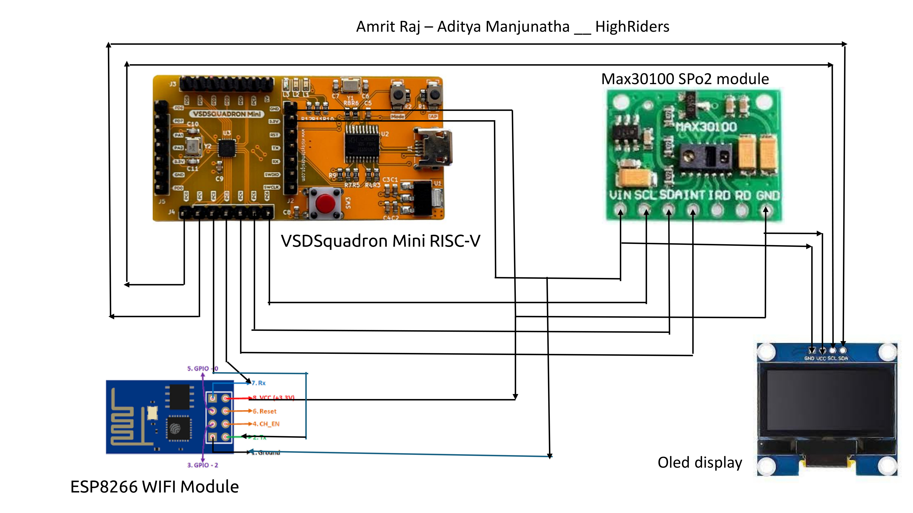

# Amrit-Raj/Aditya-Manjunath/HighRiders


# IoT Health Monitor
## Introduction
The IoT-based health monitor is designed to efficiently track heart rate and SpO2 (blood oxygen saturation) using the VSDSquadron Mini RISC-V development board and the MAX30100 sensor. This system enables continuous monitoring and data transmission through the ESP8266 WiFi module, allowing for remote health tracking via cloud platforms. Optional integration with an OLED display provides local data visualization. This technology offers a scalable and adaptable solution for personal and clinical health monitoring, leveraging advanced sensors and IoT capabilities to deliver real-time insights and long-term health data analysis

## Overview
This project focuses on developing an IoT-based health monitor to track heart rate and SpO2 (blood oxygen saturation). Utilizing the VSDSquadron Mini RISC-V development board and the MAX30100 sensor, the system is designed to provide continuous monitoring of vital signs. The integration with an ESP8266 WiFi module enables real-time data transmission to cloud platforms like ThingSpeak or AWS IoT, facilitating remote health tracking and long-term data analysis. An optional OLED display allows users to view their health metrics locally. The project involves interfacing the components through I2C and UART connections, ensuring efficient data processing and transmission. The software implementation includes sensor initialization, data acquisition, processing, and communication with the cloud. This scalable and adaptable system is suitable for various applications, from personal health tracking to clinical environments, offering a comprehensive solution for modern healthcare needs.

## Components Needed
1. **VSDSquadron Mini RISC-V Development Board**
2. **Heart Rate and SpO2 Sensor**: MAX30100 or MAX30102
3. **Display**: OLED Display (optional for local display of data)
4. **Communication Module**: WiFi module like ESP8266 or Bluetooth module like HC-05 (for IoT capabilities)
5. **Power Supply**: Battery or USB power source
6. **Connecting Wires**


## Components Pin Connections

### MAX30100 Sensor

| Pin           | VSDSquadron Mini Board Pin        |
|---------------|-----------------------------------|
| SDA           | GPIO2 (I2C SDA)                   |
| SCL           | GPIO3 (I2C SCL)                   |
| INT (Optional)| GPIO4 (Optional for interrupt-based reading) |
| VIN           | 3.3V (Power)                      |
| GND           | GND (Ground)                      |


### Circuit Connection Diagram


### Video Submission(Phase 1):
https://github.com/amroodh/Amrit_Raj-Aditya_Manjunath-HighRiders/assets/108748556/b6654732-bed9-4968-8f60-27319fe00b75


### Code
```
#include <stdint.h>
#include <stdio.h>
#include <ch32v00x.h>

// Define the GPIO pins for USART TX and RX
#define USART_TX_PIN GPIO_Pin_2
#define USART_RX_PIN GPIO_Pin_3
#define GPIO_PORT GPIOA

// MAX30100 addresses and commands
#define MAX30100_I2C_ADDRESS 0x57

#define MAX30100_REG_MODE_CONFIG 0x06
#define MAX30100_MODE_SPO2_HR 0x03

#define MAX30100_REG_LED_CONFIG 0x09
#define MAX30100_LED_CURR_50MA 0x0F
#define MAX30100_LED_CURR_27_1MA 0x27

#define MAX30100_REG_SPO2_CONFIG 0x07
#define MAX30100_SPC_PW_1600US_16BITS 0x03
#define MAX30100_SAMPRATE_100HZ 0x04

#define MAX30100_REG_TEMP_CONFIG 0x08

// USART function prototypes
void usart_init(void);
void usart_send_byte(uint8_t data);
uint8_t usart_receive_byte(void);
void usart_send_string(const char *str);

// Delay function prototype
void delay(uint32_t milliseconds);

// MAX30100 function prototypes
void configure_max30100(void);
void update_max30100(uint16_t *ir, uint16_t *red);
void write_register(uint8_t address, uint8_t reg, uint8_t value);

int main(void) {
    uint16_t ir, red;

    usart_init();
    configure_max30100();
    usart_send_string("USART Initialized\r\n");

    while (1) {
        update_max30100(&ir, &red);

        // Print data to terminal
        char buffer[64];
        sprintf(buffer, "IR: %d, Red: %d\r\n", ir, red);
        usart_send_string(buffer);

        delay(1000); // 1-second delay
    }

    return 0;
}

void usart_init(void) {
    // Enable clocks for GPIOA and USART1
    RCC_APB2PeriphClockCmd(RCC_APB2Periph_GPIOA | RCC_APB2Periph_USART1, ENABLE);

    // Configure GPIOA pin 2 (TX) as alternate function push-pull
    GPIO_InitTypeDef GPIO_InitStructure;
    GPIO_InitStructure.GPIO_Pin = USART_TX_PIN;
    GPIO_InitStructure.GPIO_Speed = GPIO_Speed_50MHz;
    GPIO_InitStructure.GPIO_Mode = GPIO_Mode_AF_PP;
    GPIO_Init(GPIO_PORT, &GPIO_InitStructure);

    // Configure GPIOA pin 3 (RX) as input floating
    GPIO_InitStructure.GPIO_Pin = USART_RX_PIN;
    GPIO_InitStructure.GPIO_Mode = GPIO_Mode_IN_FLOATING;
    GPIO_Init(GPIO_PORT, &GPIO_InitStructure);

    // Configure USART1
    USART_InitTypeDef USART_InitStructure;
    USART_InitStructure.USART_BaudRate = 115200;
    USART_InitStructure.USART_WordLength = USART_WordLength_8b;
    USART_InitStructure.USART_StopBits = USART_StopBits_1;
    USART_InitStructure.USART_Parity = USART_Parity_No;
    USART_InitStructure.USART_HardwareFlowControl = USART_HardwareFlowControl_None;
    USART_InitStructure.USART_Mode = USART_Mode_Rx | USART_Mode_Tx;
    USART_Init(USART1, &USART_InitStructure);

    // Enable USART1
    USART_Cmd(USART1, ENABLE);
}

void usart_send_byte(uint8_t data) {
    while (USART_GetFlagStatus(USART1, USART_FLAG_TXE) == RESET);
    USART_SendData(USART1, data);
}

uint8_t usart_receive_byte(void) {
    while (USART_GetFlagStatus(USART1, USART_FLAG_RXNE) == RESET);
    return (uint8_t)USART_ReceiveData(USART1);
}

void usart_send_string(const char *str) {
    while (*str) {
        usart_send_byte((uint8_t)*str++);
    }
}

void delay(uint32_t milliseconds) {
    volatile uint32_t count;
    while (milliseconds--) {
        count = 12000; // Adjust this value based on your clock speed
        while (count--);
    }
}

void configure_max30100(void) {
    write_register(MAX30100_I2C_ADDRESS, MAX30100_REG_MODE_CONFIG, MAX30100_MODE_SPO2_HR);
    write_register(MAX30100_I2C_ADDRESS, MAX30100_REG_LED_CONFIG, (MAX30100_LED_CURR_50MA << 4) | MAX30100_LED_CURR_27_1MA);
    write_register(MAX30100_I2C_ADDRESS, MAX30100_REG_SPO2_CONFIG, MAX30100_SPC_PW_1600US_16BITS | MAX30100_SAMPRATE_100HZ);
    write_register(MAX30100_I2C_ADDRESS, MAX30100_REG_TEMP_CONFIG, 0x80); // Enable high-resolution mode
}

void update_max30100(uint16_t *ir, uint16_t *red) {
    uint8_t ir_data[2];
    uint8_t red_data[2];

    // Read IR data
    usart_send_byte(MAX30100_I2C_ADDRESS << 1); // Address + Write
    usart_send_byte(0x05); // Adjust the register address as needed
    usart_send_byte((MAX30100_I2C_ADDRESS << 1) | 0x01); // Address + Read
    ir_data[0] = usart_receive_byte();
    ir_data[1] = usart_receive_byte();
    *ir = (ir_data[0] << 8) | ir_data[1];

    // Read Red data
    usart_send_byte(MAX30100_I2C_ADDRESS << 1); // Address + Write
    usart_send_byte(0x06); // Adjust the register address as needed
    usart_send_byte((MAX30100_I2C_ADDRESS << 1) | 0x01); // Address + Read
    red_data[0] = usart_receive_byte();
    red_data[1] = usart_receive_byte();
    *red = (red_data[0] << 8) | red_data[1];
}

void write_register(uint8_t address, uint8_t reg, uint8_t value) {
    usart_send_byte(address << 1);
    usart_send_byte(reg);
    usart_send_byte(value);
}
```
